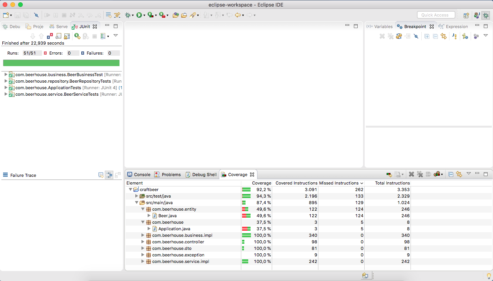

# Cadastro de cervejas artesanais

O objetivo deste projeto é avaliar o desenvolvimento de uma aplicação java utilizando Spring e APIs.

### Baseado no [Building an Application with Spring Boot](https://spring.io/guides/gs/spring-boot/).


## Preparando o ambiente

Para iniciar o projeto é necessário realizar o clone deste repositório

Após clonar este projeto, é necessário configurar o banco de dado no MySQL. Para isso faça:

- No MySQL Server use o comando:

```bash
    $ mysql -u <username> -p < <project_directory>/src/main/sql/database.sql
```

Exemplo:

```bash
    [/home/rtakemura/projects/craftbeer rtakemura]$ mysql -u root -p < ./src/main/sql/database.sql
```

Se você não tem o MySQL Server, você pode baixa-lo em https://www.mysql.com.

Para testar as Web Services, utilize o Postman (https://www.getpostman.com/):

- Ao abrir ele, você deve cadastrar ou ter um usuário cadastrado para utiliza-lo;
- Na tela principal existem duas configurações a fazer (em vermelho):
<br/>

<br/><br/>
- Para as variáveis de ambiente (importa arquivo ``postman/DEV.postman_environment.json``):
<br/>

<br/><br/>
- Para a coleção de requisições (importa arquivo ``postman/BeerHouse.postman_collection.json``):
<br/>

<br/><br/>

## Rodando a aplicação

Para rodar a aplicação:

- Importe seu projeto Maven (https://maven.apache.org/) no Eclipse (https://www.eclipse.com);
- Após ele configurar as bibliotecas, clique com o botão direito do mouse na classe ``com.beer.house.Application`` e rode ele como uma aplicação Java (Java Application);

Para rodar os JUnit (testes):

- No Eclipse, vá na pasta ``src/test/java``, clique com o botão direito, e rode a aplicação como JUnit (JUnit Application);

## Cobertura dos testes

Em uma primeira análise, a cobertura dos testes unitários está em 92.2% do total de código-fonte:
<br/>

<br/><br/>

## Troubleshooting

O sistema dá a seguinte mensagem "The port may already be in use or the connector may be misconfigured":

- Verifique se outro sistema web esta executando na porta 9000 (configuração no ``application.yml`` da pasta ``src/main/resources``);
- Mude a porta configurada (propriedade ``port``) no arquivo ``application.yml`` da pasta ``src/main/resources``;

O MySQL exibe o seguinte erro "ERROR 2002 (HY000): Can't connect to local MySQL server through socket '/tmp/mysql.sock' (2):

- Verifique se o daemon do MySQL esta iniciado;
- Use o comando ``sudo /usr/local/mysqld start`` ou ``sudo systemctl restart mysql``;

O sistema dá a seguinte mensagem "Schema-validation: missing table [beer]":

- Execute o script ``src/main/sql/database.sql`` no mysql (como usuário ``root``);
